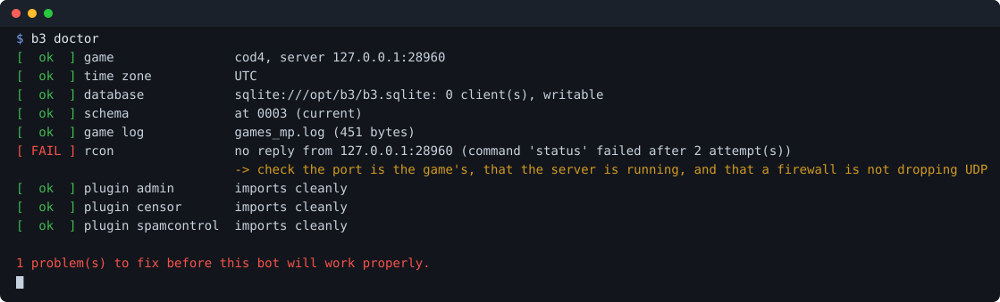

# Big Brother Bot (B3) 2.0

A modern, typed, `asyncio`-based rewrite of [Big Brother Bot](https://github.com/BigBrotherBot/big-brother-bot),
the game-server admin bot: it watches a game server, keeps a database of who played and what they did,
and gives your admins commands to act on it.

**[Read the documentation](https://sirready.github.io/BigBrotherBot/)** — the same pages as below,
with search, published from `docs/` on every push to `main`.

| **Overview** | [CLI](docs/cli.md) | [Plugins](docs/plugins.md) | [Deployment](docs/deployment.md) | [Commands](docs/commands.md) | [Configuration](docs/configuration.md) | [Games](docs/games.md) | [Migrating](docs/migrating.md) | [Development](docs/development.md) |
|---|---|---|---|---|---|---|---|---|

## What 2.0 is

The classic bot is a ~87,000-line Python **2.7** program begun in 2005. It still works, and it still
carries everything it accumulated on the way: two config formats, five threads, event ids assigned at
runtime and injected into module globals, a hand-rolled SQL builder, and calls out to
`bigbrotherbot.net` services that no longer exist.

2.0 is a **ground-up rebuild of everything underneath, with the domain logic transplanted rather than
reinvented**. The log grammars, the RCON protocols, the client/penalty/group model and every hard-won
quirk in them are ported deliberately, because they encode fifteen years of bug reports from real
servers. What they sit on is all new:

| | classic B3 | 2.0 |
|---|---|---|
| Python | 2.7 (end of life 2020) | 3.11+, fully typed, `mypy --strict` clean |
| Concurrency | 5 threads plus a timer per plugin | one `asyncio` loop, no threads |
| Config | XML *and* INI, plus a proxy object | one validated YAML file |
| Commands | registered by the `admin` plugin, so every plugin depended on it | a core service with a typed registry |
| Storage | a string-concatenating query builder | SQLAlchemy models, Alembic migrations, a legacy-DB importer |
| Events | ids assigned at runtime into module globals | a static `EventType` enum |
| Plugins | copy files into a folder | `b3 plugin install owner/repo`, pinned to a semver tag |
| Dead services | master server, version check, publist, RSS feed | deleted — [see below](#what-was-deleted-and-what-was-rebuilt) |
| First-run failures | start it and read a traceback | `b3 doctor`, which tells "wrong password" from "wrong port" |

**What that buys an operator**: one config file to edit, a bot that will not silently half-work,
migrations instead of manual `ALTER TABLE`, plugins that install by name and pin to a version, and
straight answers when something is misconfigured.

**Where it stands today.** All 59 classic admin commands at the classic levels, 38 game titles across
thirteen parser families — 34 of the classic bot's 37, plus four it never had — and every core service the
old bot offered, plus remote log tailing, PunkBuster, per-server deployment and pre-flight checks it
never had. 3,050 tests, `mypy --strict` clean.

## What was deleted, and what was rebuilt

A good deal of the classic bot was machinery for services that no longer exist. Removing it was the
original developer's own instruction, and it is most of the difference between 87,000 lines and 12,000.

**Deleted outright — nothing to port.** Every one of these called a `bigbrotherbot.net` endpoint that
has been unreachable for years:

| Legacy | What it did |
|---|---|
| `b3/update.py` | Polled `master.bigbrotherbot.net/version.json` on startup to nag about updates |
| `b3/pkg_handler.py` | The self-updater that went with it |
| `publist` plugin | Sent a heartbeat to `bigbrotherbot.net/master/serverping.php` to list your server publicly |
| `adv` plugin's news feed | Rotated in headlines from `forum.bigbrotherbot.net`'s RSS, via a `feedparser` dependency. The forum was the plugin-sharing hub; when it closed, the feed and the distribution model went with it |
| the config generator | Setup pointed you at a web page on the same dead domain to write your XML |

`b3 plugin install owner/repo` replaces that last one properly: plugins come from git, pinned to a
semver tag, instead of from a forum thread.

**Dropped on purpose: the `translator` plugin.** This one was not dead, and that is why it gets its
own paragraph rather than a row in the table above. It offered four commands and an automatic mode,
and the automatic mode sent **every chat line typed on your server** to a third party to be
translated — player names, arguments, whatever people say to each other in a game.

Reading it settled the question it had been left open on. The classic plugin does not use a
translation API, with or without a key: it calls `translate.googleapis.com/translate_a/single`, the
undocumented endpoint Google's own web page uses, with a spoofed Firefox `User-Agent`. So there is no
account to hold, no terms accepted, no rate limit anybody agreed to, and nothing stopping it breaking
or being blocked on a Tuesday.

The privacy question came up once before here, over the geolocation plugins, and it was answered by
finding a local alternative: a MaxMind-format file the operator supplies, so **no player address
leaves the machine**. There is no local equivalent for translation. That makes this a real decision
rather than a missing dependency, and the decision is no — a bot that quietly forwards a server's
chat to somebody else's API is not a default we are willing to ship. Nothing here replaces it, and
`b3 plugin install` is how anybody who wants it can run their own.

**Rebuilt rather than ported.** These were not dead, but they were the parts fifteen years of patches
had worn through:

| Legacy | Why it went | Now |
|---|---|---|
| `querybuilder.py` — SQL assembled by string concatenation | A live injection surface, and the plugin API handed it to third-party code (`storage.query()`) | SQLAlchemy models, Alembic migrations, a typed storage contract, and `Plugin.storage_engine()` for plugins that own tables |
| Event ids assigned at runtime and injected into module globals | `EVT_CLIENT_SAY` only existed once something had created it, so a typo was a runtime surprise | a static `EventType` enum — importable, type-checked, greppable |
| Command registration inside the `admin` plugin | Every other plugin therefore depended on `admin` | a core command service with a typed registry and permission bands |
| XML config, INI plugin configs, and a `MainConfig` proxy reconciling them | Three formats to get wrong, and a web page to generate one of them | one YAML file, validated by Pydantic, with `b3 doctor` to check it |
| **87 thread and timer constructions** across the tree (35 in the core and parsers, 52 more spread over 25 plugins) | Each plugin scheduling its own `threading.Timer` was the source of the bot's least reproducible bugs | one `asyncio` loop, a cron service plugins register with, and a scheduler that is testable against a fake clock |
| `getLineParts` + `On<Capwords>` reflection dispatch | A log line found its handler by string-munging a method name; a renamed method silently stopped being called | a declarative `@handles(regex)` registry, matched in definition order |
| `q3a/rcon.py` | Its Python 3 port was broken — `str(sock.recv())` corrupted every reply — in the most load-bearing module in the project | dialect / transport / orchestrator split into three testable pieces, with the retry rules preserved |
| Four threads, a lock and three queues in the BattlEye client | Its own comments record the trouble that caused | a single-threaded client that does its work when the caller asks |

**Preserved deliberately.** The opposite of the above: the log grammars, the RCON verbs per title, the
group bitmask model, the penalty semantics, the warning ladder's arithmetic, and every quirk with a
story behind it — CoD4 omitting the attacker's team on kill lines, `briefcase_bomb_mp` not counting as a
team kill, Urban Terror numbering weapons differently on hit lines than on kill lines. Those are ported
faithfully, with a regression test each, because they *are* the fifteen years of bug reports.

**In active development.** Every plugin worth porting is ported; next is a web API and a dashboard
over several servers at once.

## Try it

```bash
python -m pip install -e ".[dev]"
pytest
cd examples && python -m b3.cli -c b3.yaml replay games_mp.log   # offline replay demo
```

The replay demo boots the bot against a recorded CoD4 log: a player claims superadmin with
`!iamgod`, then bans another player — issuing RCON and recording the penalty in SQLite.

Before it runs against a real server, `b3 doctor` checks the things that go wrong on a first install
and says which one it was — the difference between "wrong password" and "wrong port" is the whole
point of it:



`b3 probe` is the other half: it shows what a server actually *says* — its raw reply, which pattern
matched it, the rows that parsed, and the log lines no handler reads. Every unverified claim in this
project is that same question, and answering it used to need somebody who could read regexes.

---

## Documentation

| Page | What is in it |
|---|---|
| [CLI](docs/cli.md) | Every `b3` command: `run`, `probe`, `init`, `db`, `update`, `plugin`, `completion` |
| [Plugins](docs/plugins.md) | What ships in the box, and how to write an installable one |
| [Deployment](docs/deployment.md) | One bot per game server, several on one machine, systemd, tailing a hosted server's log |
| [Commands](docs/commands.md) | All 59 in-game commands, groups and reach, warnings, spam |
| [Configuration](docs/configuration.md) | `b3.yaml` in full, how plugins load, message overrides, scheduling |
| [Games](docs/games.md) | What each engine needs: Frostbite, BattlEye, Source, Altitude, Homefront, Ravaged, Frontline, the CoD variants |
| [Migrating from B3 1.x](docs/migrating.md) | Bringing a classic install across: the database importer, the config mapping, and what happened to each plugin |
| [Development](docs/development.md) | The data model inherited from the classic bot, and how to work on this one |

---

## Supported games

Thirteen parser families, thirty-eight titles — `b3 games` prints the list on any install. Set
`server.game` to one of them:

<!-- generated:titles -->
| Family | How events arrive | `server.game` |
|---|---|---|
| **Altitude** | log + a command file | `altitude` |
| **BattlEye** | events over rcon | `arma2` `arma3` |
| **Call of Duty** | reads a game log | `cod` `cod2` `cod4` `cod4gr` `cod4x` `cod5` `cod6` `cod7` `cod8` `plutoiw5` <small>(MW3)</small> `plutot6` <small>(Black Ops 2)</small> |
| **Enemy Territory**<br><small>Quake 3 + its own lines</small> | reads a game log | `et` `etpro` |
| **Frontlines: Fuel of War** | events over rcon | `frontline` |
| **Frostbite** | events over rcon | `bf3` `bf4` `bfbc2` `bfh` `moh` `mohw` |
| **Homefront** | events over rcon | `homefront` |
| **Quake 3** | reads a game log | `oa081` `q3` <small>(also `q3a`)</small> `smg` `smg11` `wop` |
| **Ravaged** | events over rcon | `ravaged` |
| **Soldier of Fortune 2**<br><small>Quake 3 + its own lines</small> | reads a game log | `sof2` `sof2pm` |
| **Source** | reads a game log | `cs2` `insurgency` |
| **Urban Terror**<br><small>Quake 3 + its own lines</small> | reads a game log | `iourt41` `iourt42` `iourt43` |
| **World of Padman 1.5**<br><small>Quake 3 + its own lines</small> | reads a game log | `wop15` |
<!-- /generated:titles -->

A family is one parser; the titles in it are data — GUID length, ban verbs, the shape of the status
table. Adding a title to a family is a few lines; adding a family is a parser.

The two families differ in one structural way worth knowing. A CoD log repeats a player's identity
on every line; a Quake3 log states it **once**, in an infostring when the player connects, and
every later line is a bare slot number. A chat line names the speaker by name, or by slot and name
on the titles that write both — where the two disagree the name wins, because some of these engines
report chat against the wrong slot and attributing a `!command` to the wrong player is how the wrong
person gets banned.

Capture-the-flag, awards, item pickups and generic objectives all arrive as events on every title in
this family. Beyond that, the Urban Terror / ET / SoF2 / World of Padman 1.5 rows are the shared
grammar **plus** that title's own lines, read by a subclass — a title never loses a line by gaining a
family of its own:

- **Urban Terror** — `Hit:` (non-fatal hits with a hit location, which is what makes team-damage
  policing possible), `Radio:`, private chat, spawns, kill assists, flags, capture times, bomb mode
  and the voting lines. A hit line carries no damage figure, so the damage comes from a
  weapon×hit-location table, and hit lines number weapons on a *different* scale from kill lines.
  Radio is policed by `spamcontrol` like any other chat channel. Names longer than the protocol
  allows are truncated, and by default the player is kicked — that length is an exploit rather than a
  nickname; `server.allow_long_names: true` keeps the truncation and lets them play. Not included:
  UrT's `auth` account service, and the freeze-tag and jump-run lines (they belong with the plugins
  that want them).
- **Enemy Territory** — `ConnectInfo:`, which is where an ET player's identity comes from: a plain ET
  server sets no `cl_guid` at all, so without this line nobody could hold a level or a ban. Also
  `Gib:` and ET's own slot-numbered chat lines, which beat matching a colour-coded name.
- **Soldier of Fortune 2** — its `Hit:` line, which states the damage outright.
- **World of Padman 1.5** — its own kill line (`Kill: <attacker> <means-of-death> <victim>`, a
  different shape from every other title here) and its `Damage:` line for non-fatal hits.

---

## Requirements

- Python 3.11+
- `git` on `PATH` (only for `b3 plugin install/update`)
- No system time-zone database needed; `tzdata` is installed as a dependency

## Sponsors

If this bot runs your server, [sponsoring it](https://github.com/sponsors/SirReaDy) is what keeps it
maintained. It is a rewrite carrying fifteen years of other people's bug reports, and the work that
takes is unglamorous: reading a captured test from 2011 to find out why a title numbers its weapons
differently, or driving a real bot against a fake server to discover a feature that never worked.

Where it goes, in the order it gets spent:

- **Titles nobody can test without owning them.** Most faults found here were found by running the
  bot against a real server, not by reading the code. Some engines nobody has spare.
- **What is not built yet.** A web API and dashboard over several servers, a Discord relay, and
  Prometheus metrics. None of the three has a counterpart in the classic bot.
- **Keeping 38 titles working.** A game updates its log format and the bot goes quiet about it; that
  is the recurring cost of supporting engines their publishers stopped touching years ago.

No feature here is paywalled and none will be: it is GPL, and sponsoring buys time rather than
access. Issues and pull requests are worth as much — see [Contributing](CONTRIBUTING.md).

## License

[GPL-2.0-or-later](LICENSE), inherited from the original B3 project — the classic bot is GPL-2.0, and
a rewrite that transplants its log grammars, RCON protocols and domain model is a derived work, so it
carries the same licence. In practice: use it, run it, change it, ship it, but a distributed fork
carries its source under the same terms.
